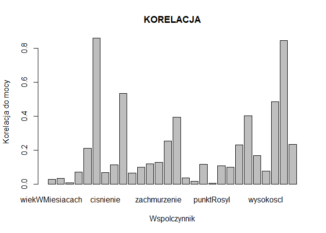
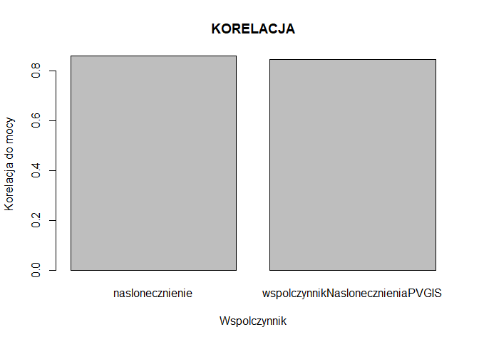

## Wstêp

W raporcie zawarto wyliczenia modelu regresyjnego prognozuj¹cego mocy urz¹dzenia fotowoltaicznego.
Model mo¿na z ma³ym b³êdem uproœciæ do nastêpuj¹cego równania:

P = 0.16 + naslonecznienie * 0.82 + wspolczynnikNaslonecznieniaPVGIS * 0.36

## 1. Wykorzystane biblioteki

W trakcie pracy wykorzystano pakiety wy³¹cznie pakiety wymagane do uruchomienia R Markdown Document oraz Shiny.

## 2. Wczytanie danych i powtarzalnoœæ wyników

Przed ka¿dorazowym wybraniem zbioru danych do treningu i weryfikacji ustawiany jest seed liczb losowych. Stanowi to pewny sposób na powtarzalnoœæ wyników analizy.


```r
set.seed(666)
```

## 3. Wczytywanie danych

Dane s¹ wczytywane z pliku csv dostarczonego z wymaganiami projektu. Nastêpnie zamieniana jest kolejnoœæ kolumn w celu ³atwiejszego wykorzystania funkcji lm tworz¹cej model liniowy. Funkcja lm domyœlnie wybiera pierwsz¹ kolumnê jako zmienn¹ zale¿n¹. Nazwy wykorzystywanych kolumn zostaj¹ podmienione.


```r
    dat = read.csv("elektrownie.csv", header = TRUE)
    data <- dat[c(51,1:50)]

    colnames_tmp <- colnames(data)
    colnames_tmp[3] <- "idMiejsca"
    colnames_tmp[4] <- "idModelu"
    colnames_tmp[5] <- "idMarki"
    colnames_tmp[8] <- "wiekWMiesiacach"
    colnames_tmp[9] <- "rok"
    colnames_tmp[10] <- "dzien"
    colnames_tmp[11] <- "moment"
    colnames_tmp[13] <- "temperaturaOtoczenia"
    colnames_tmp[14] <- "naslonecznienie"
    colnames_tmp[15] <- "cisnienie"
    colnames_tmp[16] <- "predkoscWiatur"
    colnames_tmp[17] <- "wilgotnosc"
    colnames_tmp[19] <- "punktRosy"
    colnames_tmp[20] <- "lozyskoWiatrowe"
    colnames_tmp[21] <- "zachmurzenie"
    
    colnames_tmp[22] <- "temperaturaI"
    colnames_tmp[23] <- "naslonecznienieI"
    colnames_tmp[24] <- "cisnienieI"
    colnames_tmp[25] <- "predkoscWiatuIr"
    colnames_tmp[26] <- "wilgotnoscI"
    colnames_tmp[27] <- "punktRosyI"
    colnames_tmp[28] <- "lozyskoWiatroweI"
    colnames_tmp[29] <- "zachmurzenieI"
    
    colnames_tmp[30] <- "odleglosc"
    colnames_tmp[31] <- "wysokosc"
    colnames_tmp[32] <- "szerkoscGeograficzna"
    colnames_tmp[33] <- "wysokoscI"
    colnames_tmp[34] <- "szerkoscGeograficznaI"
    
    colnames_tmp[50] <- "wspolczynnikNaslonecznieniaPVGIS"
    colnames_tmp[51] <- "wspolczynnikNaslonecznieniaPVGISI"
    colnames(data) <- colnames_tmp
    
    # uzycie tylko danych liniowych
    data <- data[c(1,8:11,13:34,50:51)]
#...

    indexes <- function(){
      set.seed(666);
      sample(1:nrow(data), size=0.8*nrow(data));
    }
    
    test <- function() {
      data[indexes(),];
    }
    
    train <- function() {
      data[-indexes(),]
    }
```

## 4. Brakuj¹ce dane

Z racji nie posiadania wiedzy o mo¿liwych wartoœciach parametrów dane, które wykorzystujemy do obliczeñ uznajemy za czyste. U¿ywamy do obliczeñ tylko kolumn, co do których mamy uzasadnione podejrzenie, ¿e s¹ ci¹g³e. Wszystkie zmienne, co do których istnieje w¹tpliwoœæ na rzecz danych kategorycznych pomijamy.


```r
#data <- data[c(1,8:11,13:34)]
```

## 5. Rozmiar i statystyki

Rozmiar pliku csv to 66,3MB. U¿yto jednak tylko po³owê kolumn, resztê wartoœci pominiêto ze wzglêdu braku pewnoœci co do ich ci¹g³oœci.

## 6. Wartoœci atrybutów

U¿ywamy do obliczeñ tylko kolumn, co do których mamy uzasadnione podejrzenie, ¿e s¹ ci¹g³e. Wszystkie zmienne, co do których istnieje w¹tpliwoœæ na rzecz danych kategorycznych pomijamy.


```r
summary(data)
```

```
##       kwh         wiekWMiesiacach       rok           dzien       
##  Min.   :0.0000   Min.   :0.0000   Min.   :2012   Min.   :0.0000  
##  1st Qu.:0.0000   1st Qu.:0.0000   1st Qu.:2012   1st Qu.:0.2520  
##  Median :0.0490   Median :0.1250   Median :2012   Median :0.4770  
##  Mean   :0.1688   Mean   :0.3145   Mean   :2012   Mean   :0.4812  
##  3rd Qu.:0.3320   3rd Qu.:0.7190   3rd Qu.:2013   3rd Qu.:0.7100  
##  Max.   :1.0000   Max.   :1.0000   Max.   :2013   Max.   :1.0000  
##      moment      temperaturaOtoczenia naslonecznienie    cisnienie     
##  Min.   :0.000   Min.   :0.0450       Min.   :0.0000   Min.   :0.0000  
##  1st Qu.:0.222   1st Qu.:0.2120       1st Qu.:0.0000   1st Qu.:0.7480  
##  Median :0.500   Median :0.3480       Median :0.0350   Median :0.7530  
##  Mean   :0.500   Mean   :0.3734       Mean   :0.1091   Mean   :0.6504  
##  3rd Qu.:0.778   3rd Qu.:0.5300       3rd Qu.:0.2040   3rd Qu.:0.7550  
##  Max.   :1.000   Max.   :0.8180       Max.   :0.7100   Max.   :0.7690  
##  predkoscWiatur      wilgotnosc          icon          punktRosy     
##  Min.   :0.00000   Min.   :0.1600   Min.   :0.0000   Min.   :0.1390  
##  1st Qu.:0.04200   1st Qu.:0.5400   1st Qu.:0.0830   1st Qu.:0.5350  
##  Median :0.06600   Median :0.7000   Median :0.6670   Median :0.6190  
##  Mean   :0.07622   Mean   :0.6844   Mean   :0.4623   Mean   :0.6055  
##  3rd Qu.:0.10200   3rd Qu.:0.8400   3rd Qu.:0.6670   3rd Qu.:0.6830  
##  Max.   :0.69600   Max.   :1.0000   Max.   :0.7500   Max.   :0.8650  
##  lozyskoWiatrowe   zachmurzenie    temperaturaI    naslonecznienieI
##  Min.   :0.0000   Min.   :0.000   Min.   :0.0090   Min.   :0.108   
##  1st Qu.:0.3000   1st Qu.:0.230   1st Qu.:0.0730   1st Qu.:0.216   
##  Median :0.4780   Median :0.310   Median :0.1110   Median :0.220   
##  Mean   :0.4512   Mean   :0.359   Mean   :0.1225   Mean   :0.222   
##  3rd Qu.:0.6600   3rd Qu.:0.510   3rd Qu.:0.1260   3rd Qu.:0.222   
##  Max.   :0.7690   Max.   :1.000   Max.   :0.9830   Max.   :1.000   
##    cisnienieI       predkoscWiatuIr    wilgotnoscI        punktRosyI    
##  Min.   :0.000000   Min.   :0.00000   Min.   :0.03400   Min.   :0.0630  
##  1st Qu.:0.000000   1st Qu.:0.03700   1st Qu.:0.04400   1st Qu.:0.1140  
##  Median :0.000000   Median :0.03800   Median :0.04400   Median :0.1140  
##  Mean   :0.000237   Mean   :0.03852   Mean   :0.06384   Mean   :0.1194  
##  3rd Qu.:0.000000   3rd Qu.:0.03900   3rd Qu.:0.06200   3rd Qu.:0.1180  
##  Max.   :1.000000   Max.   :1.00000   Max.   :0.57900   Max.   :0.4150  
##  lozyskoWiatroweI zachmurzenieI      odleglosc         wysokosc     
##  Min.   :0.0000   Min.   :0.0000   Min.   :0.0000   Min.   :0.1110  
##  1st Qu.:0.3360   1st Qu.:0.1960   1st Qu.:0.1913   1st Qu.:0.4190  
##  Median :0.3360   Median :0.1960   Median :0.4590   Median :0.5640  
##  Mean   :0.3455   Mean   :0.2062   Mean   :0.4686   Mean   :0.5464  
##  3rd Qu.:0.3390   3rd Qu.:0.1980   3rd Qu.:0.7268   3rd Qu.:0.6810  
##  Max.   :1.0000   Max.   :1.0000   Max.   :1.0000   Max.   :0.8840  
##  szerkoscGeograficzna   wysokoscI      szerkoscGeograficznaI
##  Min.   :0.1280       Min.   :0.0000   Min.   :0.0000       
##  1st Qu.:0.2950       1st Qu.:0.0960   1st Qu.:0.2090       
##  Median :0.4250       Median :0.1360   Median :0.2880       
##  Mean   :0.4546       Mean   :0.2055   Mean   :0.3653       
##  3rd Qu.:0.6350       3rd Qu.:0.2660   3rd Qu.:0.4820       
##  Max.   :0.8180       Max.   :0.9820   Max.   :1.0000       
##  wspolczynnikNaslonecznieniaPVGIS wspolczynnikNaslonecznieniaPVGISI
##  Min.   :0.0000                   Min.   :-0.0250                  
##  1st Qu.:0.0000                   1st Qu.: 0.1580                  
##  Median :0.0560                   Median : 0.1940                  
##  Mean   :0.1767                   Mean   : 0.1967                  
##  3rd Qu.:0.3250                   3rd Qu.: 0.2130                  
##  Max.   :1.0000                   Max.   : 1.0060
```

## 7. Korelacja miêdzy moc¹ a reszt¹ wspó³czynników


```r
    correlation <- function() {
      #temporary = c(1:51)
      temporary <- c(1:29);
      for (i in 2:29) {
        temporary[i] <- cor(train()[[i]],train()[[1]]);
        if (temporary[i] < 0) {
          temporary[i] <- -temporary[i];
        }
      }
      temporary[1] <- -1;
      
      temporary;
    }

    bad <- function() {
      min <- 0;
      correlation() > min;
    }
    
    good <- function() {
      #min=input$decimal;
      min <- 0.6;
      correlation() > min;
    }
    
    goodAnd1 <- function() {
      temporary <- good();
      temporary[1] <- T;
      temporary;
    }
    
    model <- function() {
      temporary <- lm(train()[goodAnd1()])
      temporary
    }
    
      #Barplot ze wszystkimi wartosciami
      barplot(correlation()[bad()],names.arg = colnames(train()[bad()]),
              main="KORELACJA",
              ylab="Korelacja do mocy",
              xlab="Wspolczynnik");
```

<!-- -->

```r
      #Barplot z wartosciami wykorzystanymi w modelu
      barplot(correlation()[good()],names.arg = colnames(train()[good()]),
              main="KORELACJA",
              ylab="Korelacja do mocy",
              xlab="Wspolczynnik");
```

<!-- -->

## 8. Interaktywna moc w czasie i przestrzeni


```r
      #TO DO
```

## 9. Model


```r
      cof <- model()$coefficients;
      
      names <- names(model()$coefficients);
      names[1] = 'bias';
      
      hprint <- matrix("",model()$rank,2);
      for (i in 1:model()$rank) {
        hprint[i,2] <- cof[i];
        hprint[i,1] <- names[i];
      }
      
      as.data.frame(hprint,optional = T)
```

Blad modelu jest nastêpuj¹cy:


```r
      error_vec <- unname(predict.lm(model(),test())) - test()[,1];
      error_vec <- error_vec * error_vec;
      mean(error_vec)
```

## 10. Analiza modelu

Model mo¿e korzystaæ z 2 wartoœci - pomiaru nas³onecznienia oraz wspó³czynnika PVGIS. Wszelkie inne pomiary mo¿emy pomin¹æ generuj¹c bardzo ma³y dodatkowy b³¹d.
Najdok³adniejszy model uzyskujemy wykorzystuj¹c wysztkie wartoœci, jednak czas jego budowania oraz wykorzystania jest znacznie d³u¿szy, a wyniki zbli¿one. St¹d jego przydatnoœæ jest znikoma.
